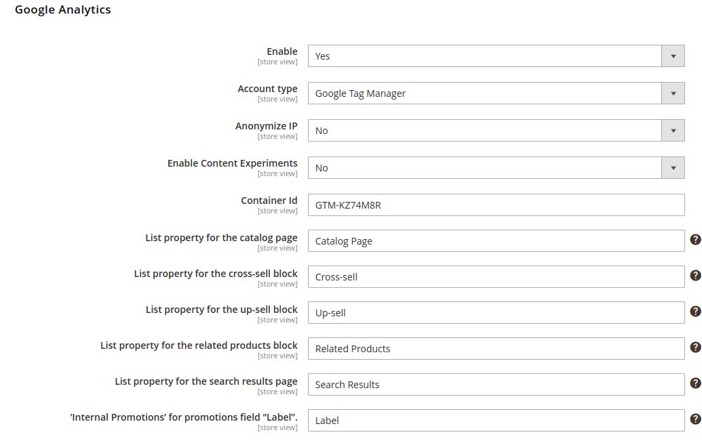
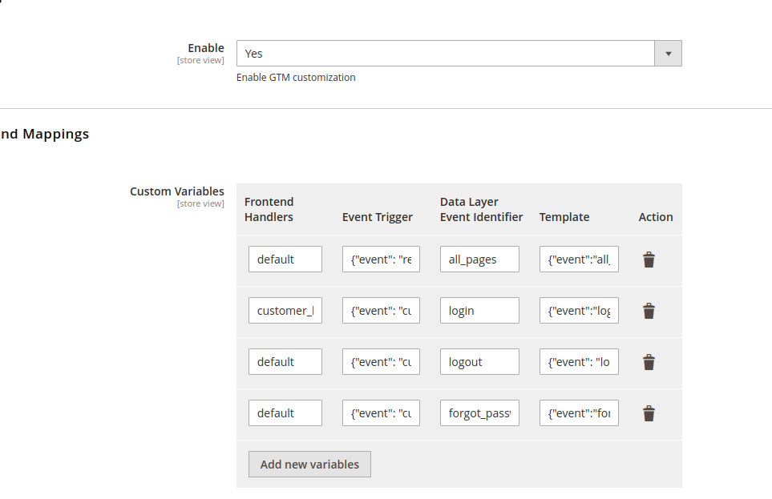

# README #

## GTM Customization Module ##
### Introduction ###
- This module is for manipulating the GTM events which default modules is unable to adapt the client's requirements.
- In this module we have 3 main parts:
#### Data Collectors:
- The main job of the data collectors is for collecting the Object for specifics entity
- Ex: 
    - `customer` : Customer information
    - `cms` : Articles information
    - `category` : Category Information
    - ...
- How to implement a fully Collectors and Adding to the CollectorComposite?
    - [SHOULD] create a new type of collector inside of `Model/Data/Colelctors` directory.
    - [MUST] Implement the CollectorInterface
    - [SHOULD] : adding the declared class into SM\GTM\Model\Data\CollectorComposite::$collectorList if you need to add data to Global Scope.
    - [SHOULD] : Use setter and getter to get the original object instead of force the object from other source.
#### Data Mappers:
- Why we have this? The answer is "We need to simplified the object to deliver to frontend and used by Event Template Processor"
- The objects for mapping 
- How to create a new Mapper?
    + The simplest way to do that is declaring the virtualType from default Mapper `SM\GTM\Model\Mapper\Mapper`
    + Add the map fields with the convention below:
    ```xml
      <argument name="mappingFields" xsi:type="array">
        <item name="{$destinationField}" xsi:type="string">{$sourceAttribute}</item>
        <item name="menu_category" xsi:type="string">category_level_1.name</item>
      </argument>
    ```
#### Event Template Processor:
+ We have the variables which were provided by the 2 parts above and they will be stored as the object `window.DataLayerSourceObject`. You can check for the variables by open web console and print them out.
+ Some custom javascript events will be triggered to perform for special events: Ex: `customer:login`, `customer:register`, ...
+ The EJS library was used to appending the value into templates and send to GTM.
+ [EJS Reference](https://ejs.co/)

### Configuration ###
> To enable the GTM, first of all we should to configure the Magento_GoogleTagManager
> 
>Config Path: Sales > Google API



> Configuration the Custom Frontend Events and Templates
> Config Path: SmartOSC > Google Tag Manager



#### Example Event ####
- Frontend Handles: `default` (Deprecated)
- Event Trigger:
```json
{"event": "customer:login-success", "selector": "document"}
```
- Data Layer Event Identifier: `login`  (The identifier - Not Affect to the DataLayer body)
- Template:
```json
{"event":"login","uniqueUserID":"<%= customer.uniqueUserID; %>","userID":"<%= customer.userID; %>","customerID":"<%= customer.customerID; %>","loginType":"<%= customer.loginType; %>","customerType":"<%= customer.customerType; %>","loyalty":"<%= customer.loyalty; %>","customerStatus":"<%= customer.customerStatus; %>","pageCategory":"home","pageSubCategory":"article","articleId":"article01","articleTitle":"insertArticletitle","articleCategory":"insertArticleCategory","articleSource":"insertArticleSource","articlePresent":"Yes","publishedDate":"2019-11-15","store_name":"<%= store.store_name; %>","store_ID":"<%= store.store_ID; %>"}
```


### Note: ###
- For the private data which will be change dynamically and not ruled by Full-Page Cache, Please use ajax to pull the information:
    - For Example: Please take a look on the Customer Information:
        + To pull customer data, a new controller has been created `\SM\GTM\Controller\Gtm\CustomerInfo` and pulled via AJAX because varnish does not cache the AJAX requests.
